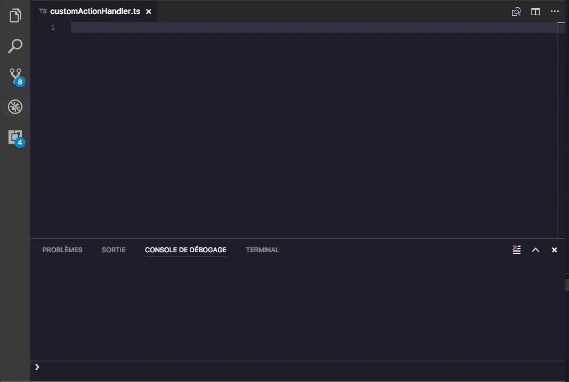

# Vulcainjs Typescript Snippet Changelog

This extension for Visual Studio Code adds snippets for Vulcainjs for TypeScript.


[Vulcainjs](http://www.vulcainjs.org/) is an open-Source Microservice Framework for nodejs.



See the [CHANGELOG](CHANGELOG.md) for the latest changes

## Usage
Type part of a snippet, press `enter`, and the snippet unfolds.

### TypeScript Snippets
```typescript
vc-actionhandler                 // create default class actionHandler
vc-eventhandler                  // create default class eventHandler
vc-queryhandler                  // create default class queryHandler
```